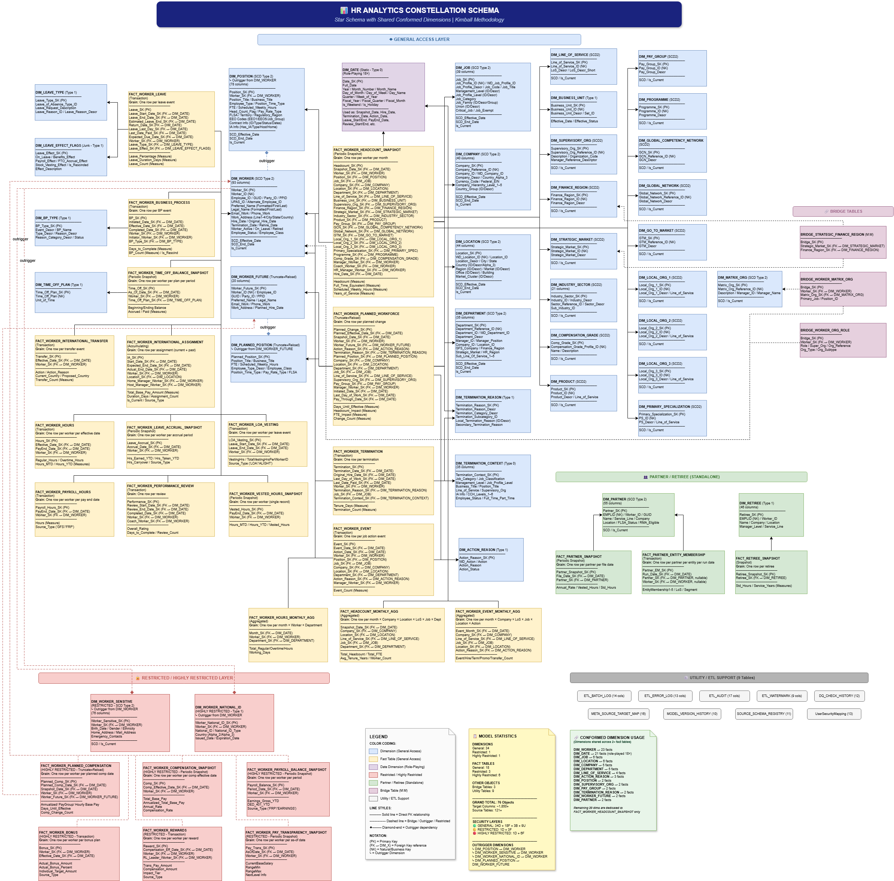
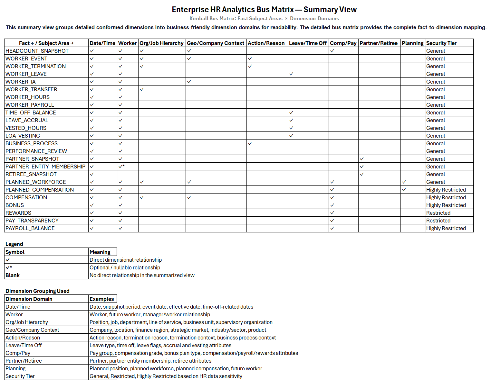
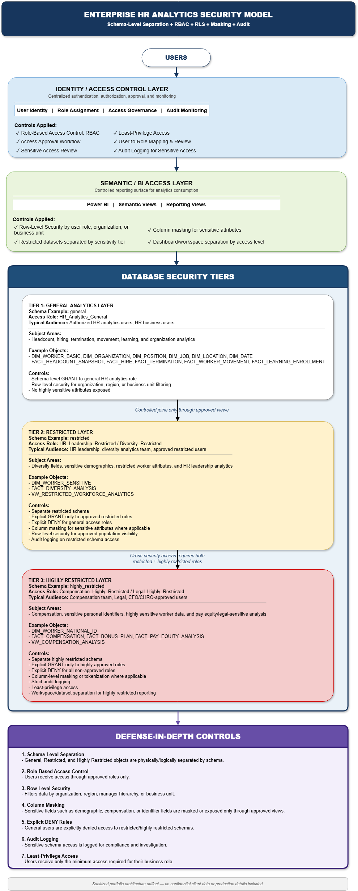
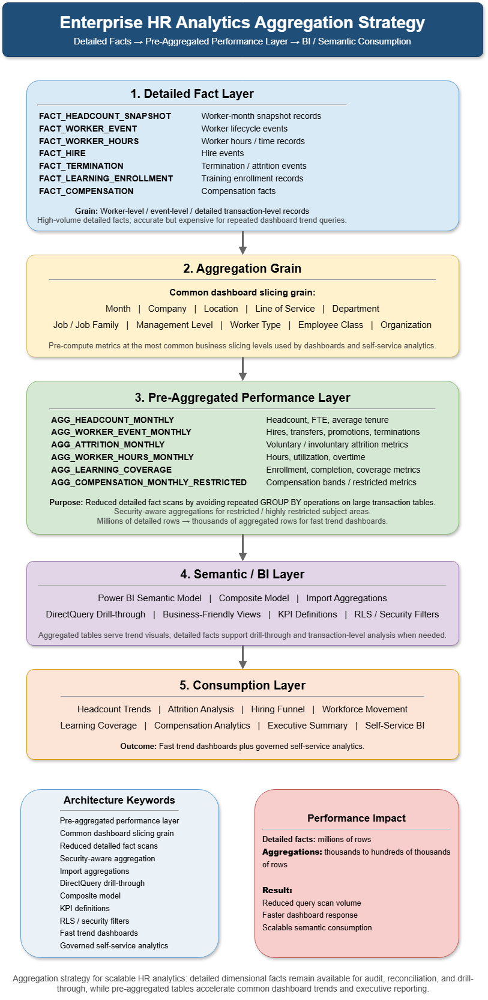

# Enterprise HR Analytics Dimensional Model — Kimball Blueprint

## Overview
This repository contains a dimensional modeling blueprint for an enterprise HR analytics platform. The design demonstrates how HR workforce data can be modeled using Kimball methodology to support scalable reporting, self-service analytics, governed access, point-in-time analysis, data quality controls, and performance-optimized BI consumption.

The blueprint covers workforce, organization, position, hiring, termination, movement, compensation, learning, and performance subject areas using a multi-object constellation schema with shared conformed dimensions and multiple business-process fact tables.

This is a sanitized portfolio artifact created to demonstrate data modeling and data architecture thinking. It is not client documentation and does not include proprietary data, production code, confidential system details, or real employee information.

## What This Demonstrates
- Kimball-style dimensional modeling for HR analytics
- Star/constellation schema design
- Fact and dimension modeling
- SCD Type 2 history tracking
- Conformed dimensions
- Role-playing dimensions
- Bridge tables for many-to-many relationships
- Security tiering for sensitive HR data
- Pre-aggregation strategy for BI performance
- Source-to-target mapping approach
- Data quality and reconciliation considerations
- Power BI / semantic layer consumption design

## Business Questions Supported
This model demonstrates a dimensional modeling approach designed to support questions such as:
- What was headcount by organization, location, job family, and month?
- How has attrition changed by tenure, level, business unit, or geography?
- Which workers moved across organizations, jobs, locations, or managers?
- How do hiring, termination, compensation, performance, and learning trends relate?
- How can sensitive HR data be secured while enabling self-service analytics?
- How can dashboards deliver fast response times at enterprise scale?

## Modeling Approach
The model follows Kimball dimensional modeling principles using a constellation schema with shared conformed dimensions and multiple business-process fact tables.

**Key design patterns include:**
- Conformed dimensions for consistent slicing across facts
- SCD Type 2 dimensions for historical point-in-time reporting
- Role-playing date and worker dimensions
- Bridge tables for many-to-many relationships
- Pre-aggregated summary tables for dashboard performance
- Security-tiered schema design for sensitive HR data
- Semantic views for business-friendly consumption
- Data quality and reconciliation checks across layers

## Architecture Diagrams

| Diagram | Description |
|---|---|
| [High-Level Architecture](diagrams/hr-analytics-high-level-architecture.png) | Simplified source-to-consumption platform flow. |
| [End-to-End Architecture — Detailed View](diagrams/hr-analytics-end-to-end-architecture-detailed.png) | Detailed architecture covering source feeds, ETL, DQ, warehouse, security, semantic layer, users, and outcomes. |
| [Constellation Schema](diagrams/hr-analytics-constellation-schema.png) | Kimball-style HR analytics constellation schema. |
| [Bus Matrix Summary](diagrams/hr-analytics-bus-matrix-summary.png) | Summary of fact-to-dimension domain relationships. |
| [Detailed Bus Matrix](diagrams/hr-analytics-bus-matrix-detailed.png) | Detailed fact-to-dimension mapping. |
| [Security Model](diagrams/hr-analytics-security-model.png) | Three-tier HR analytics security design. |
| [Aggregation Strategy](diagrams/hr-analytics-aggregation-strategy.png) | Pre-aggregated performance layer for BI consumption. |

## High-Level Architecture

The high-level architecture shows the source-to-consumption flow of an enterprise HR analytics platform: source systems, curated DataHub layer, ETL processing, Kimball-style dimensional warehouse, security tiers, semantic/BI layer, business users, and business outcomes. 

The design separates integration, modeling, security, aggregation, and consumption concerns to support scalable and governed HR analytics.

The model is organized around shared enterprise dimensions and HR business-process facts.

**Core design areas:**
- Worker and organization dimensions
- Position, job, location, company, department, and Line of Service dimensions
- Headcount, hiring, termination, movement, compensation, performance, and learning facts
- SCD2 history for point-in-time reporting
- Bridge tables for multi-valued relationships
- Aggregation tables for dashboard performance
- Security tiers for general, restricted, and highly restricted data

## End-to-End Architecture — Detailed View
[View Enterprise HR Analytics Platform Detailed Architecture](diagrams/hr-analytics-end-to-end-architecture-detailed.png)

This detailed architecture view expands the high-level flow into source feeds, curated DataHub structures, ETL processing, data quality, audit logging, metadata governance, Kimball dimensional warehouse design, security tiers, semantic/BI consumption, business user groups, and business outcomes.

For easier navigation, see the simplified high-level architecture diagram first.

## Constellation Schema

The constellation schema connects multiple HR business-process facts to shared conformed dimensions. This enables consistent analysis across workforce, movement, compensation, performance, learning, hiring, and termination subject areas.

**Key characteristics:**
- Shared conformed dimensions across facts
- Multiple fact tables at different grains
- Role-playing dimensions for dates and worker relationships
- Bridge tables for many-to-many relationships
- Aggregation tables for high-volume dashboard queries

## Bus Matrix — Summary View

The bus matrix summarizes how HR business-process fact tables connect to shared conformed dimension domains. It demonstrates the Kimball bus architecture approach, where common dimension domains such as Date, Worker, Organization, Job, Company, Location, Department, Compensation, Leave, Partner/Retiree, and Planning are reused across multiple HR analytics subject areas including workforce, movement, leave, compensation, performance, planning, partner, and retiree analytics.

The detailed bus matrix is available here:
[Detailed Bus Matrix](diagrams/hr-analytics-bus-matrix-detailed.png)

## Core Dimensions
Representative dimensions include:
- `DIM_WORKER`
- `DIM_ORGANIZATION`
- `DIM_POSITION`
- `DIM_JOB`
- `DIM_LOCATION`
- `DIM_COMPANY`
- `DIM_DEPARTMENT`
- `DIM_LINE_OF_SERVICE`
- `DIM_DATE`
- `DIM_PERFORMANCE_RATING`
- `DIM_LEARNING_COURSE`

Dimension design patterns include SCD Type 2, conformed dimensions, hierarchical dimensions, static dimensions, and role-playing dimensions.

## Core Facts
Representative fact tables include:
- `FACT_HEADCOUNT_SNAPSHOT`
- `FACT_WORKER_EVENT`
- `FACT_HIRE`
- `FACT_TERMINATION`
- `FACT_MOVEMENT`
- `FACT_COMPENSATION`
- `FACT_PERFORMANCE`
- `FACT_LEARNING_ENROLLMENT`

The model uses periodic snapshot facts, transaction facts, aggregated facts, and factless fact patterns where appropriate.

## SCD Type 2 Strategy
SCD Type 2 is used to preserve historical attribute changes for point-in-time reporting.

**Typical SCD2 columns include:**
- Surrogate key
- Business key
- Effective start date
- Effective end date
- Current row indicator
- Change hash/checksum
- Audit columns

This enables reporting such as headcount by organization, job, location, or management level as of a specific historical period.

## Bridge Tables
Bridge tables are used to handle many-to-many relationships and hierarchical reporting needs.

**Examples include:**
- Worker-to-organization role relationships
- Worker-to-region assignments
- Organization hierarchy paths
- Multi-valued worker attributes

Bridge design considerations include effective dating, allocation percentage, hierarchy paths, and double-counting prevention.

## Security Model

The security model separates HR analytics data into general, restricted, and highly restricted layers. It uses security controls such as schema-level separation, role-based access control (RBAC), row-level security, column masking, explicit DENY rules, audit logging, sensitive access review, and least-privilege access.

## Aggregation Strategy

The aggregation strategy introduces a pre-aggregated performance layer between detailed fact tables and the BI semantic layer. Common dashboard metrics are pre-computed at business-friendly grains such as month, company, location, line of service, department, job family, management level, worker type, employee class, and organization.

This reduces repeated scans over detailed fact tables while still allowing detailed facts to remain available for audit, reconciliation, transaction-level analysis, and drill-through.

**Common aggregation grains include:**
- Month
- Organization
- Location
- Job family
- Department
- Company
- Management level

This supports faster Power BI dashboards and scalable self-service analytics.

## BI Consumption Pattern
The BI consumption layer is designed for governed, business-friendly analytics.

**Consumption patterns include:**
- Power BI semantic model
- Composite model design
- Import mode for smaller dimensions
- DirectQuery for large facts where needed
- Aggregation tables for trend dashboards
- Semantic views with business-friendly naming
- Row-level security for user-based access

## Data Quality Considerations
Data quality checks are designed across ingestion, transformation, modeling, and consumption layers.

**DQ categories include:**
- Completeness
- Uniqueness
- Referential integrity
- Valid value/range checks
- Source-to-target reconciliation
- Volume anomaly checks
- SCD2 current-row validation

## Detailed Documentation
- [High-Level Architecture](documentation/high-level-architecture.md)
- [End-to-End Architecture](documentation/end-to-end-architecture.md)
- [Dimensional Model Overview](documentation/dimensional-model-overview.md)
- [Fact Table Design](documentation/fact-table-design.md)
- [Dimension Table Design](documentation/dimension-table-design.md)
- [SCD Type 2 Strategy](documentation/scd2-strategy.md)
- [Bridge Table Design](documentation/bridge-table-design.md)
- [Data Quality Framework](documentation/data-quality-framework.md)
- [Security and Access Model](documentation/security-and-access-model.md)
- [BI Consumption Pattern](documentation/bi-consumption-pattern.md)
- [Grain Definitions](documentation/grain-definitions.md)
- [KPI Definitions](documentation/kpi-definitions.md)

## Confidentiality Note
This repository contains only sanitized, generic architecture and data modeling artifacts created for portfolio purposes. It does not include proprietary client documentation, confidential data, internal system names, credentials, production code, or real employee/customer data.

## Author
**Sri Adilakshmi Marrivada**  
Lead Consultant | Data Platform Architect | 19+ Years Experience  
[LinkedIn Profile](https://www.linkedin.com/in/sri-adilakshmi-marrivada)
