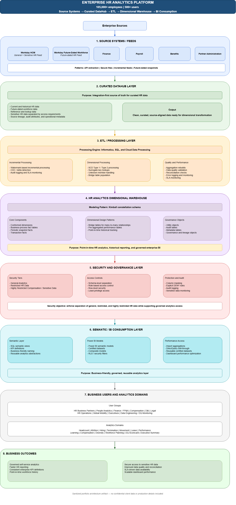

# High-Level Architecture

## Overview
This document explains the high-level architecture of an enterprise HR analytics platform designed to support governed, scalable, and performance-optimized workforce analytics.

The architecture follows a source-to-consumption pattern:
> Source Systems → Curated DataHub → ETL / Processing → Dimensional Warehouse → Security & Governance → Semantic / BI Layer → Business Users → Business Outcomes

The design demonstrates how enterprise HR data can be integrated, curated, transformed, modeled, secured, and consumed through a Kimball-style analytics platform.
This is a sanitized portfolio artifact created to demonstrate data platform architecture and dimensional modeling thinking. It is not client documentation and does not include proprietary data, production code, credentials, internal system names, or real employee information.

## High-Level Architecture Diagram

The high-level diagram shows the major platform layers and how data flows from enterprise HR source systems to governed analytics consumption.

## 1. Source Systems / Feeds
The platform starts with multiple enterprise HR and workforce-related source systems.

**Representative source domains include:**
- Core HR / HCM
- Future-dated workforce data
- Finance and labor data
- Payroll and benefits data
- Partner / leadership administration data
- Sensitive HR data
- Learning and performance data

**Common source patterns include:**
- API extraction
- Secure file-based feeds
- Incremental feeds
- Future-dated snapshots
- Sensitive data feeds with restricted access controls

The purpose of this layer is to capture workforce data from operational systems while preserving source traceability and security requirements.

## 2. Curated DataHub Layer
The Curated DataHub layer acts as an integration-first source of truth for HR data.
This layer organizes source-aligned data into curated structures that can support downstream integrations and analytical transformation.

**Key responsibilities include:**
- Maintaining current and historical HR data
- Managing future-dated workforce data
- Preserving reference and lookup data
- Separating sensitive HR data by access requirements
- Capturing source lineage, audit attributes, and operational metadata
- Preparing clean, curated data for dimensional transformation

This layer is not primarily optimized for BI consumption. Instead, it provides trusted, curated input for the dimensional warehouse.

## 3. ETL / Processing Layer
The ETL / Processing layer transforms curated HR data into a dimensional analytics model.

**Core capabilities include:**
- Watermark-based incremental processing
- Change data capture / delta detection
- SCD Type 1 and Type 2 processing
- Surrogate key lookups
- Unknown member handling
- Bridge table population
- Aggregation rebuilds
- Data quality validation
- Reconciliation checks
- Error logging and monitoring
- Audit logging and SLA monitoring

The ETL layer is designed to support reliable, repeatable, and SLA-driven data processing.

## 4. HR Analytics Dimensional Warehouse
The dimensional warehouse is designed using Kimball methodology and follows a constellation schema pattern.

**The warehouse includes:**
- Conformed dimensions
- Business-process fact tables
- Periodic snapshot facts
- Transaction facts
- Bridge tables for many-to-many relationships
- Pre-aggregated performance tables
- Utility objects
- Audit tables
- Metadata tables
- Governance and lineage objects

The purpose of this layer is to provide a governed analytical foundation for point-in-time workforce reporting, historical analysis, dashboard performance, and enterprise BI consumption.

### Key Dimensional Design Patterns
- Kimball constellation schema
- Conformed dimensions shared across multiple facts
- Multiple fact grains
- SCD Type 2 for historical tracking
- SCD Type 1 for reference/classification data
- Type 0 static dimensions where history does not change
- Role-playing dimensions
- Bridge tables for many-to-many relationships
- Unknown member handling
- Pre-aggregated performance layer

## 5. Security and Governance Layer
HR analytics platforms require strong governance because the data may include sensitive demographic, compensation, payroll, legal, and personal information.

**The security model uses three broad tiers:**

### General Analytics
Used for broadly authorized HR analytics such as:
- Headcount
- Hiring
- Termination
- Movement
- Leave
- Learning
- Organization analytics

### Restricted HR Data
Used for sensitive HR analytics such as:
- Diversity fields
- Sensitive demographics
- Restricted worker attributes
- HR leadership analytics

### Highly Restricted Data
Used for highly sensitive subject areas such as:
- Compensation
- Bonus
- Payroll balances
- Sensitive personal identifiers
- Pay equity / legal-sensitive analysis
- Planned compensation

**Security and governance controls include:**
- Schema-level separation
- Role-based access control
- Row-level security
- Column masking
- Explicit DENY rules
- Audit logging
- Sensitive data monitoring
- Least-privilege access
- Workspace or dataset separation for sensitive reporting

## 6. Semantic / BI Consumption Layer
The semantic and BI layer provides governed, reusable, and business-friendly access to the dimensional warehouse.

**Representative components include:**
- SQL semantic views
- KPI definitions
- Business-friendly naming
- Reusable analytics abstractions
- Power BI semantic models
- Certified datasets
- Composite models
- Import aggregations
- DirectQuery drill-through
- Row-level security filters

This layer abstracts technical warehouse structures into business-friendly views and certified semantic models for analysts, HR users, and executives.

### Performance Access Pattern
**A common performance pattern is:**
- Use imported dimensions and aggregation tables for fast dashboard slicing
- Use DirectQuery or drill-through for detailed fact-level analysis
- Apply row-level security and security filters through the semantic layer
- Provide certified datasets for governed self-service analytics

## 7. Business Users and Analytics Domains
The platform supports multiple enterprise stakeholder groups.

**Representative user groups include:**
- HR business partners
- People analytics teams
- Finance / FP&A
- Compensation teams
- Diversity and inclusion teams
- Legal and compliance teams
- HR operations
- Global mobility teams
- Executives
- Data engineering and DQ monitoring teams

**Representative analytics domains include:**
- Headcount
- Attrition
- Hiring
- Termination
- Movement
- Leave
- Performance
- Learning
- Compensation
- Diversity
- Workforce planning
- Data quality scorecards
- Executive workforce summaries

## 8. Business Outcomes
The architecture is designed to deliver the following outcomes:
- Governed self-service analytics
- Faster workforce reporting
- Consistent enterprise KPI definitions
- Point-in-time workforce history
- Secure access to sensitive HR data
- Improved data quality and reconciliation
- SLA-driven data availability
- Scalable dashboard performance

## Architecture Principles
The design is guided by the following principles:

### 1. Separate integration from analytics
The Curated DataHub supports integration and downstream distribution, while the dimensional warehouse supports analytics and BI consumption.

### 2. Use conformed dimensions
Shared dimensions provide consistent slicing across HR business-process facts.

### 3. Preserve historical context
SCD Type 2 and snapshot facts support point-in-time workforce analysis.

### 4. Design security into the model
General, restricted, and highly restricted layers enforce access based on data sensitivity.

### 5. Optimize for BI performance
Aggregation tables and semantic models reduce repeated scans over detailed facts.

### 6. Support both summary and detail
Aggregations support fast dashboards, while detailed facts remain available for drill-through, audit, and reconciliation.

### 7. Treat data quality as a platform capability
DQ checks, reconciliation controls, and audit logging are built into the platform architecture.

### 8. Enable governed self-service
Semantic views, certified datasets, KPI definitions, and security filters enable safe and reusable analytics.

## Related Diagrams

- [High-Level Architecture](../diagrams/hr-analytics-high-level-architecture.png)
- [End-to-End Architecture — Detailed View](../diagrams/hr-analytics-end-to-end-architecture-detailed.png)
- [Constellation Schema](../diagrams/hr-analytics-constellation-schema.png)
- [Bus Matrix Summary](../diagrams/hr-analytics-bus-matrix-summary.png)
- [Detailed Bus Matrix](../diagrams/hr-analytics-bus-matrix-detailed.png)
- [Security Model](../diagrams/hr-analytics-security-model.png)
- [Aggregation Strategy](../diagrams/hr-analytics-aggregation-strategy.png)

## Confidentiality Note
This document is a sanitized portfolio artifact created for data architecture demonstration purposes. It does not include proprietary client documentation, 
confidential data, production code, credentials, internal system names, or real employee/customer data.
